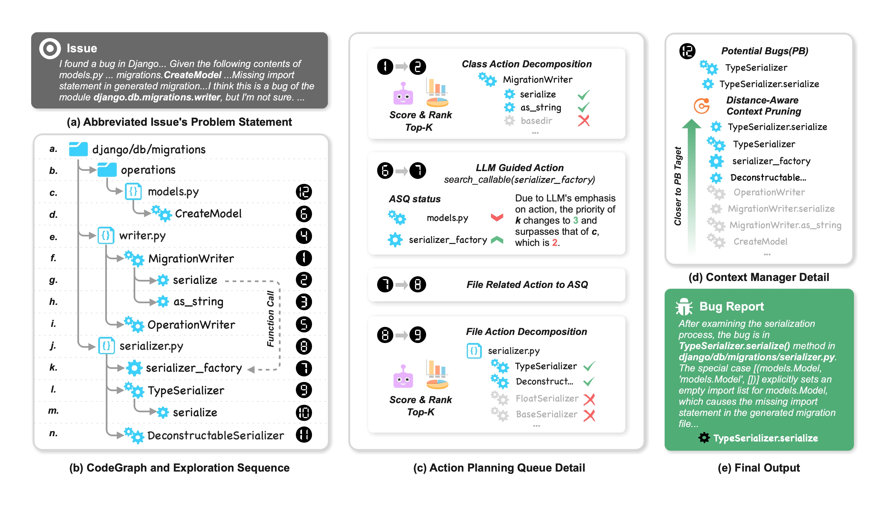

# OrcaLoca

OrcaLoca (previous named Orcar), an LLM agent framework that improves accuracy for software issue localization by integrating priority-based scheduling for LLM-guided action, action decomposition with relevance scoring, and distance-aware context pruning.



## Prerequisite

OrcaLoca requires docker to run, so please first pull our docker image (forked from [SWE-Agent](https://github.com/SWE-agent/SWE-agent)):

```shell
docker pull hejiaz/swe-agent:latest
```

OrcaLoca also requires API access to LLM. (Currently OpenAI & Anthropic APIs are supported)
You can either export them in CLI:
```shell
export OPENAI_API_KEY={key_here}
export ANTHROPIC_API_KEY={key_here}
```
or as a key.cfg file:
```
OPENAI_API_KEY: key_here
ANTHROPIC_API_KEY: key_here
```

OrcaLoca also uses torch in its search process. ([torch installation guide](https://pytorch.org/get-started/locally/))

## Installation
```shell
cd OrcarLLM

conda create -n agentless python=3.10
conda activate agentless
pip install -e .
```

After installation succeeded, you can run a quick smoke test (should finish in 5-10 minutes):
```shell
python evaluation/run.py --final_stage extract --instance_ids astropy__astropy-12907 astropy__astropy-6938
```

Then add search stage into running:
```shell
python evaluation/run.py --final_stage search --instance_ids astropy__astropy-12907
```

## Reproducing OrcaLoca Leaderboard Submission

### Genrating Search results
```shell
python evaluation/run.py
```

### Genrating output.json
```shell
cd evaluation
python process_output.py
```

### Preparing Data for Agentless Edition
Please go through instructions in:
1. evaluation/orcar_agentless/README.md
2. thirdparty/Agentless/README_orcar.md
To run agentless with 1-hop relation subgraph, you will also need to generate the `dependency_output.json`.
```shell
cd evaluation
python process_dependency.py
```

### Evaluating all_preds.jsonl
Our output all_preds.jsonl can be evaluated with official scripts offered by [SWE-Bench](https://github.com/swe-bench/SWE-bench).
Please check the 'Set Up' and 'Usage' parts in its README.md for details.
